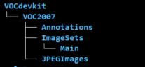

## DCIC_2019_Glodon

---

### 比赛链接：

- [智能盘点—钢筋数量AI识别](https://www.datafountain.cn/competitions/332/details)

---

### 代码说明：

这个代码相比原版本的keras-yolov3的实现，增加了以下处理：

- 增加了 NMS 的处理，具体代码可以参考`yolo.py`文件
- 实现了预测图片可视化结果保存，具体代码可以参考`step_5_predict.py`文件
- `visual/visual.py`是可视化训练集Boxes的代码

---

### 快速开始：

- 首先在[百度网盘](https://pan.baidu.com/s/1wekoQM_TL1HWi3uxmDYkFw)，或者通过`wget https://pjreddie.com/media/files/yolov3.weights`下载yolov3的预训练文件，然后将下载好的模型文件放入**model_data**文件夹

- 接着把训练、测试图片以及标签放入**data**文件夹，并且要重新建立好**VOCdevkit**文件夹，具体文件目录如下图所示：



- 然后依次运行以下代码：

1. step_1_process_data.py &nbsp;&nbsp;&nbsp;&nbsp;&nbsp;&nbsp;&nbsp;&nbsp;&nbsp; 将原本的csv文件转变成voc格式的xml文件

2. step_2_mv_data.py &nbsp;&nbsp;&nbsp;&nbsp;&nbsp;&nbsp;&nbsp;&nbsp;&nbsp;&nbsp;&nbsp;&nbsp;&nbsp;&nbsp;&nbsp;&nbsp; 移动文件到指定的目录(方便yolov3模型读写)

3. step_3_voc_annotation.py &nbsp;&nbsp;&nbsp;&nbsp;&nbsp; 自动构建训练目录

4. step_4_train.py &nbsp;&nbsp;&nbsp;&nbsp;&nbsp;&nbsp;&nbsp;&nbsp;&nbsp;&nbsp;&nbsp;&nbsp;&nbsp;&nbsp;&nbsp;&nbsp;&nbsp;&nbsp;&nbsp;&nbsp;&nbsp;&nbsp;&nbsp;  训练模型

5. step_5_predict.py &nbsp;&nbsp;&nbsp;&nbsp;&nbsp;&nbsp;&nbsp;&nbsp;&nbsp;&nbsp;&nbsp;&nbsp;&nbsp;&nbsp;&nbsp;&nbsp;&nbsp;&nbsp;&nbsp; 预测并生成最后提交结果

---

### 参数修改：

- anchors 大小在 model_data 下 yolo_anchors.txt

值得注意的是 anchors 可以根据[ lars76/kmeans-anchor-boxes ](https://github.com/lars76/kmeans-anchor-boxes)以及[ YOLO-v3模型参数anchor设置 ]( https://blog.csdn.net/m_buddy/article/details/82926024 )修改成适合自己数据集大小。

- `yolo.py`文件修改的参数

```
classes_path = 'model_data/my_classes.txt'
model_path = 'logs/000/trained_weights_final.h5'
model_image_size = (640, 640)
gpu_num = 2
max_boxes = 300
score_threshold = 0.1
iou_threshold = 0.45
```

- `step_4_train.py`文件修改的参数
 
```
# 修改的参数
max_boxes = 300
val_split = 0.2
input_shape = (640, 640)
epochs_freeze = 30
batch_size_unfreeze = 4
classes_path = 'model_data/my_classes.txt'
```

---

### 资料参考：

- 其他未尽事宜可参考链接[ qqwweee ](https://github.com/qqwweee/keras-yolo3)
